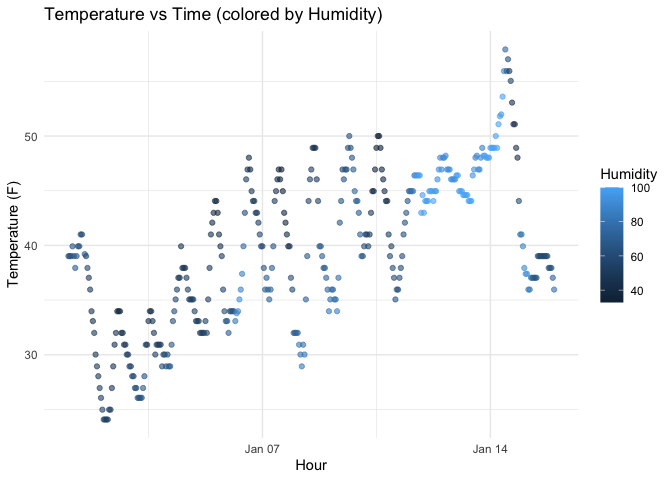

Homework 1
================
WL3010
2025-09-20

## R Markdown

This is an R Markdown document. Markdown is a simple formatting syntax
for authoring HTML, PDF, and MS Word documents. For more details on
using R Markdown see <http://rmarkdown.rstudio.com>.

When you click the **Knit** button a document will be generated that
includes both content as well as the output of any embedded R code
chunks within the document. You can embed an R code chunk like this:

``` r
summary(cars)
```

    ##      speed           dist       
    ##  Min.   : 4.0   Min.   :  2.00  
    ##  1st Qu.:12.0   1st Qu.: 26.00  
    ##  Median :15.0   Median : 36.00  
    ##  Mean   :15.4   Mean   : 42.98  
    ##  3rd Qu.:19.0   3rd Qu.: 56.00  
    ##  Max.   :25.0   Max.   :120.00

## Including Plots

You can also embed plots, for example:

<!-- -->

Note that the `echo = FALSE` parameter was added to the code chunk to
prevent printing of the R code that generated the plot.

## Problem 1

We load the dataset and make a scatterplot:

``` r
library(moderndive)
library(ggplot2)

data("early_january_weather")

p <- ggplot(early_january_weather, aes(x = time_hour, y = temp, color = humid)) +
  geom_point(alpha = 0.6) +
  labs(title = "Temperature vs Time (colored by Humidity)",
       x = "Hour",
       y = "Temperature (F)",
       color = "Humidity") +
  theme_minimal()

p
```

<!-- -->

``` r
# save plot to file
ggsave("scatterplot_temp_time.png", plot = p, width = 7, height = 5)


## Problem 2

library(tidyverse)
```

    ## ── Attaching core tidyverse packages ──────────────────────── tidyverse 2.0.0 ──
    ## ✔ dplyr     1.1.4     ✔ readr     2.1.5
    ## ✔ forcats   1.0.0     ✔ stringr   1.5.1
    ## ✔ lubridate 1.9.4     ✔ tibble    3.3.0
    ## ✔ purrr     1.1.0     ✔ tidyr     1.3.1
    ## ── Conflicts ────────────────────────────────────────── tidyverse_conflicts() ──
    ## ✖ dplyr::filter() masks stats::filter()
    ## ✖ dplyr::lag()    masks stats::lag()
    ## ℹ Use the conflicted package (<http://conflicted.r-lib.org/>) to force all conflicts to become errors

``` r
set.seed(123)

num_var <- rnorm(10)                           
log_var <- num_var > 0                         
char_var <- letters[1:10]                      
fac_var <- factor(rep(c("A","B","C"), length.out = 10)) 

df <- data.frame(
  num_var = num_var,
  log_var = log_var,
  char_var = char_var,
  fac_var = fac_var
)

df
```

    ##        num_var log_var char_var fac_var
    ## 1  -0.56047565   FALSE        a       A
    ## 2  -0.23017749   FALSE        b       B
    ## 3   1.55870831    TRUE        c       C
    ## 4   0.07050839    TRUE        d       A
    ## 5   0.12928774    TRUE        e       B
    ## 6   1.71506499    TRUE        f       C
    ## 7   0.46091621    TRUE        g       A
    ## 8  -1.26506123   FALSE        h       B
    ## 9  -0.68685285   FALSE        i       C
    ## 10 -0.44566197   FALSE        j       A

``` r
mean(pull(df, num_var))   
```

    ## [1] 0.07462564

``` r
mean(pull(df, log_var))  
```

    ## [1] 0.5

``` r
as.numeric(pull(df, log_var))   
```

    ##  [1] 0 0 1 1 1 1 1 0 0 0

``` r
as.numeric(pull(df, char_var))   
```

    ## Warning: NAs introduced by coercion

    ##  [1] NA NA NA NA NA NA NA NA NA NA

``` r
as.numeric(pull(df, fac_var))    
```

    ##  [1] 1 2 3 1 2 3 1 2 3 1

``` r
mean(as.numeric(pull(df, log_var)))  
```

    ## [1] 0.5

``` r
mean(as.numeric(pull(df, fac_var)))   
```

    ## [1] 1.9
